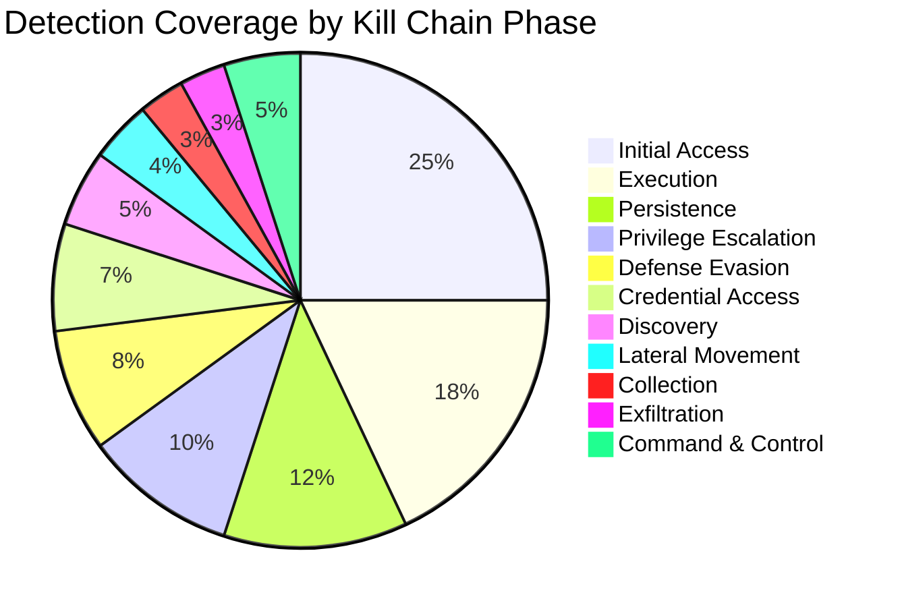
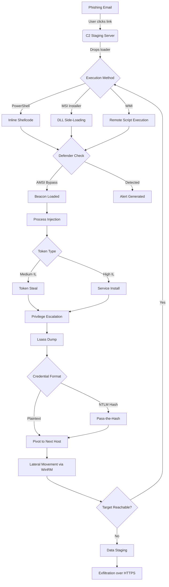
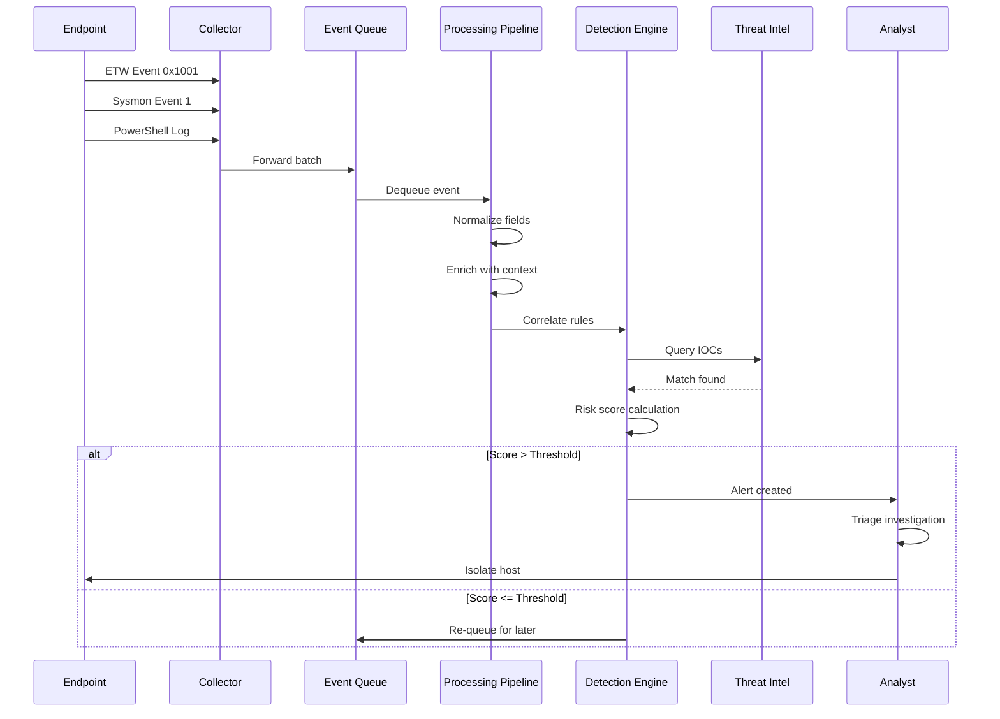
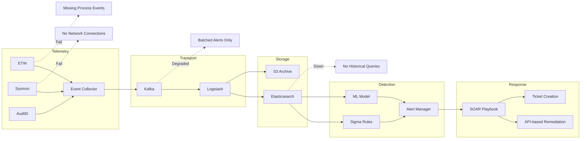
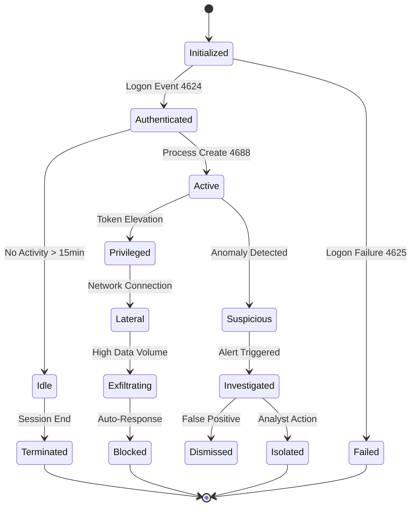

# Adversary Simulation & Detection Engineering

## Summary

This research looks at how to model adversary behavior, simulate attack paths, and map detection coverage using structured diagrams. The goal is to build a reusable methodology for evaluating defensive posture through visual threat modeling — not just as a one-time exercise, but as something that can evolve as the attack surface changes.

## Why Diagrams?

Detection engineering suffers from the same problem as every other documentation-heavy discipline: it is hard to keep static text aligned with a dynamic environment. Diagrams help here because they force precision. A flowchart that branches on detection logic reveals gaps that prose can hide. A pie chart of telemetry coverage tells you immediately where you are blind.

Mermaid is the medium because it is text-based, version-controllable, and can live alongside the code and config it describes.

## Coverage Breakdown

The first thing to understand is how detection resources are currently distributed across the kill chain. Without this, you cannot prioritize what to simulate.

This makes the imbalance obvious: most detections sit at the front of the chain. Later stages — lateral movement, collection, exfiltration — are severely under-covered. That is exactly where real damage happens.

## Attack Path Simulation

A simulated attack path helps validate whether the existing detections actually fire in the right order. Below is a common initial access to privilege escalation chain.

This graph is useful because it reveals where detections are expected to fire. If you have no alerts at the AMSI bypass step but claim to detect PowerShell abuse, you have a blind spot.

## Detection Pipeline Sequence

The following sequence diagram models how telemetry flows from endpoint to analyst console. It exposes delays and transformation points where data can be lost.

The key insight here is the enrichment and correlation steps. If the pipeline drops events during normalization (malformed fields, missing timestamps), the detection engine never sees them. That is a silent failure mode.

## Dependency Graph

Below is a dependency graph of the detection stack itself. This helps visualize what happens when a single component fails.

The dotted failure paths (`.->`) show single points of failure. If the transport layer (Kafka) degrades, everything downstream is delayed. If Elasticsearch goes down, detection becomes blind.

## State Machine: Session Lifecycle

A session — whether benign or malicious — follows predictable state transitions. Understanding these helps write stateful detection rules instead of relying on single-event matching.

Stateful detection is more powerful than threshold-based alerting because it understands context. A network connection from a session in the "Idle" state is more suspicious than one from "Active."

## Current State

This is an early draft. The diagrams are the main output so far — they function as both analysis tools and documentation. The next step is to validate these models against real detection rules and telemetry sources.

## Next Steps

- Map each graph node to a concrete Sigma rule or detection query
- Identify gaps where no detection exists for a node
- Build a small tool that generates these diagrams from live detection config
- Test the attack path graph in a lab environment with real adversary emulation

## Open Questions

- How often should these diagrams be regenerated from live data?
- Can the dependency graph be auto-generated from infrastructure-as-code?
- Is there a way to derive coverage percentages in the pie chart from actual alert volume instead of manual estimation?
